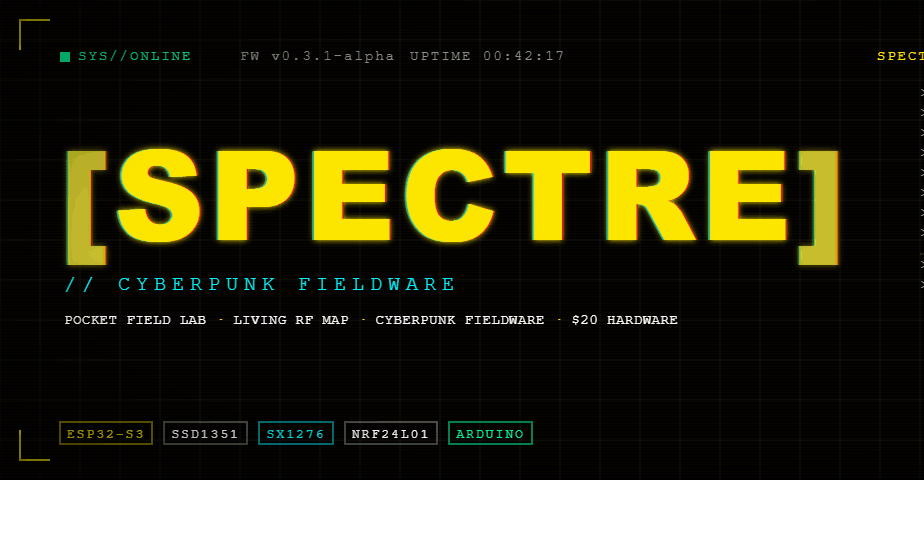
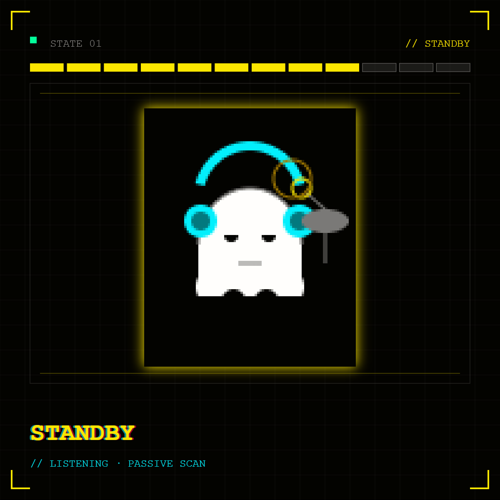
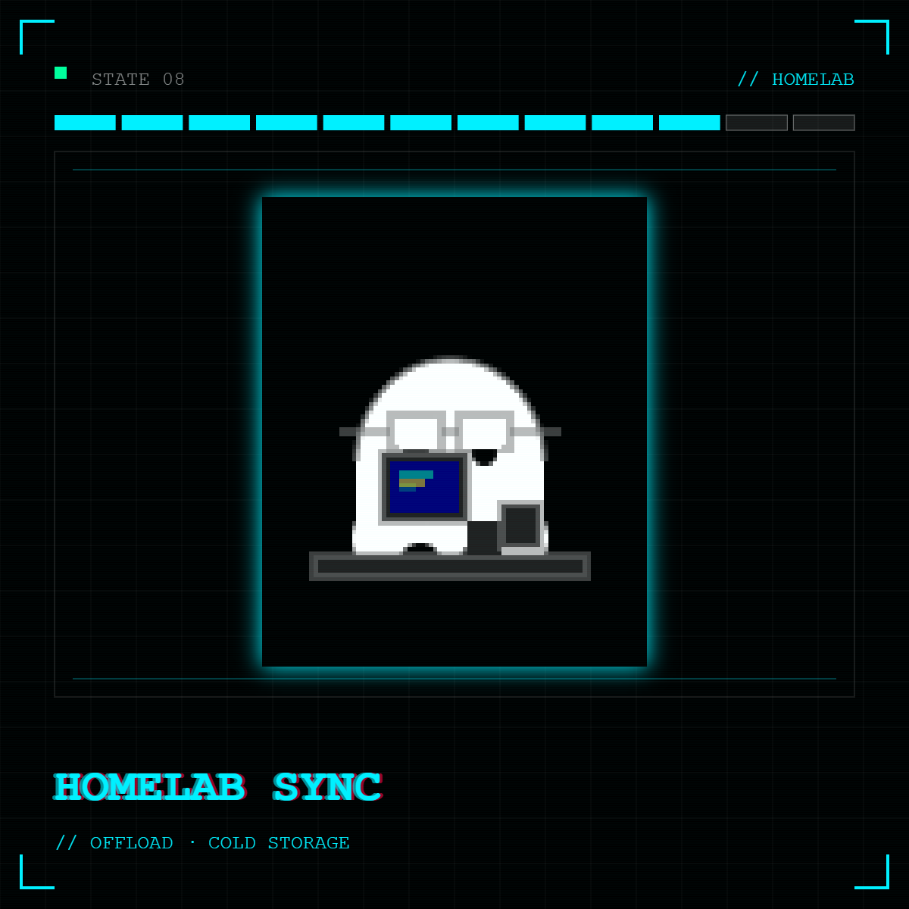
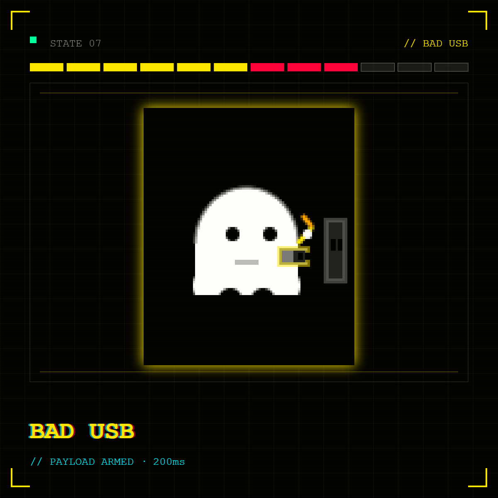
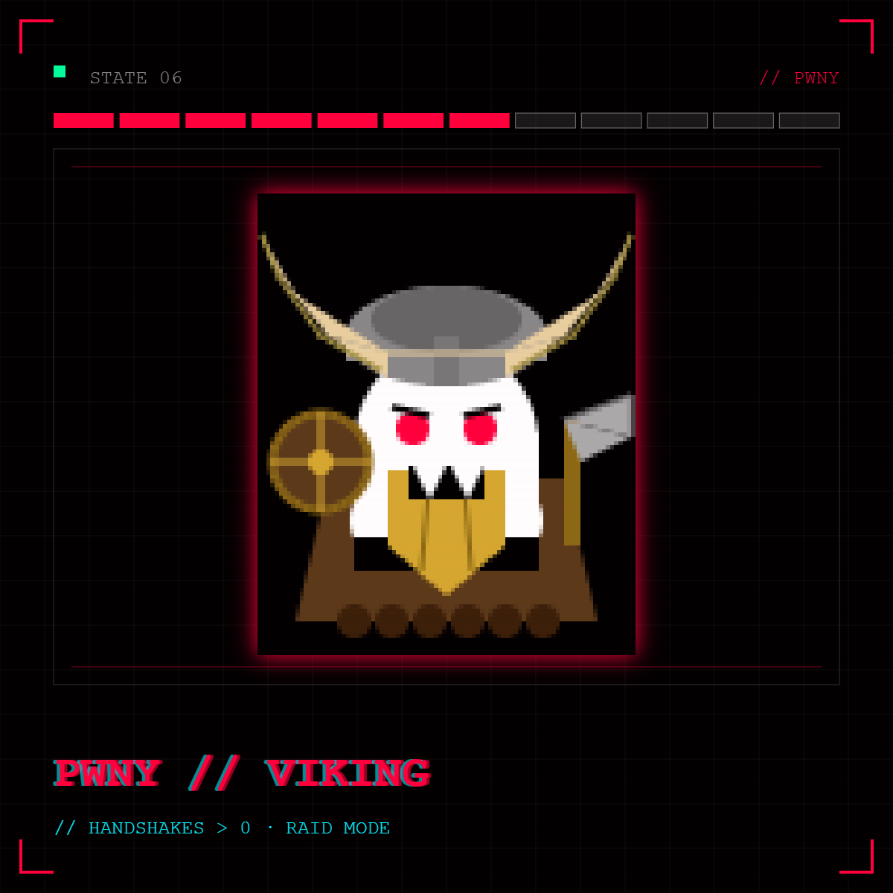
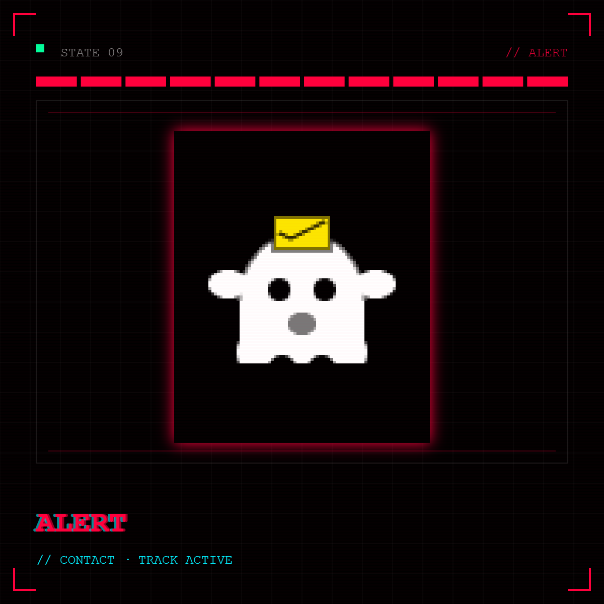
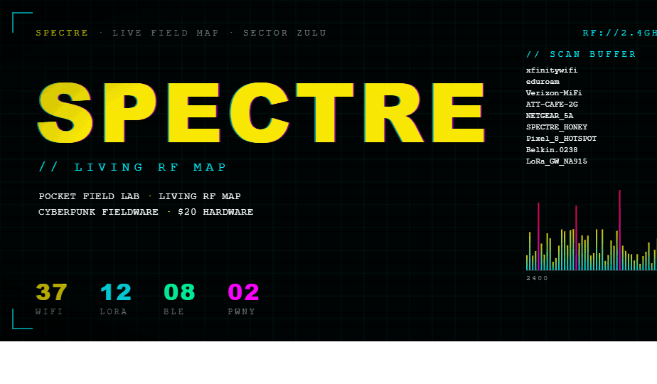

<b>Responsible use</b>

 

Spectre is a security research, field-observation, and learning platform.

Use it only with hardware, systems, networks, and radio environments where you have permission to test or observe. Some features are intended for controlled lab use.

The purpose of this project is embedded engineering, wireless research, RF mapping, and operator tooling — not unauthorized access or disruption.

---

  

<h1 align="center">Spectre</h1>

  <b>Pocket field lab. Living RF map. Cyberpunk fieldware. $20 hardware.</b>

  <b>Spectre is a cyberpunk field node that extends a stationary RF sensor network with GPS-tagged collection, autonomous sync, companion-assisted enrichment, and a modular radio toolkit for real-world wireless reconnaissance.</b>

## What is Spectre?

Spectre is a pocket-sized field intelligence platform for extending a stationary RF sensor network into the real world.

It collects wireless activity in the field, tags it with location and mission context, stores it locally, and syncs it back home to enrich a larger RF database. With the companion phone app, Spectre can use GPS, relay storage, provide operator input, and bridge data through MQTT during extended missions. Back at base, collected data can feed map overlays, trilateration workflows, drone tracking, and long-term RF environment analysis.

It is the cheapest homemade cyberpunk field lab out there, and now you can have one too. RF sensor network and custom RF database not included.

---

## Mascot states

  
  
  

  
  

  
  Different mascot states. They are all rendered against LVGL sprite background in C. Animated, several frames each. There are many more!
  

## Designed as a system

Spectre is not a pile of demos bolted onto an ESP32.

Every major subsystem was built around the same field work idea. The storage engine exists because we only have 8mb of flash to work with in LittleFS, and I want to survive long runtimes. The companion app exists because mobile GPS, relay capability, and operator input make the stationary network smarter. The custom encrypted BLE layer exists because the phone link is meant to be operational without becoming an Android developer. The UI theme exists because its fun, and cool. It also let me use LVGL for the first time - TFT is out.

Nothing here is an afterthought. Spectre is meant to be used by me personally, and there is effort and design in all of it. Figure out how to make it better, and let me know!

---

## Why it matters

| Capability | What it means |
|---|---|
| **Living RF Map** | GPS-tagged collection + home sync turns field observations into database-backed map overlays that evolve over time. |
| **Network Extension** | A stationary sensor network gains a mobile scout that can validate, enrich, and expand coverage. |
| **Companion-Assisted Missions** | A phone can provide GPS, storage relay, text input, BadUSB payload transfer, and MQTT bridging when the mission needs more reach. |
| **Autonomous Field Lab** | Spectre can operate without the phone, collect data, classify events, enrich events with GPS data, and sync later. |
| **PWNY Mode** | A custom WiFi operator workflow for controlled lab capture, target pressure, PMKID collection, and mission-aware recon. |
| **Cheap + Modular** | Built around inexpensive, prebuilt, easy-to-obtain ESP32-S3 hardware with GPIO expansion for new radios, sensors, and mission modules. |
| **Automation-First Behavior** | Spectre collects, tags, enriches, syncs, compacts, and manages power automatically wherever possible. |

---

## Core features

### Living RF Mapping

  

Spectre turns field observations into spatial intelligence. GPS-tagged collection and synchronized home uploads allow RF activity to be layered over satellite or other map imagery, creating a continuously improving view of the environment.

This is the core idea: the stationary network watches from home, while Spectre walks the field and brings back context.

---

### Stationary Network Extension

Spectre is a mobile node for a broader sensor ecosystem. It brings field mobility to a stationary sensing architecture, helping expand coverage, validate detections, and improve the database behind the network.

Instead of treating field work as a separate activity, Spectre makes it part of the same intelligence loop.

---

### Companion Enrichment

The Android companion can provide GPS, relay data, extend storage, provide text input, support BadUSB script write/upload workflows, and bridge to MQTT in case 20k records isnt enough for your mission.

Spectre discovers the phone, connects, authenticates, encrypts the session, exchanges batches, and writes enriched records back to storage.

The companion link is not just “BLE connected, good enough.” Spectre uses a custom app-layer trust model with modern cryptography so the phone can act as part of the platform without exposing your phone to anyone who may be listening. Weirdos.

> **18-record encrypted BLE enrichment batch sent, received, and written back to storage in roughly 500 ms.**

That gets the radio back in the action instead of leaving the device stuck in housekeeping.

---

### Advanced Storage Engine

Spectre uses a compact binary spool for high-density field storage, with JSON exposed at the edges for debugging, export, and readability.

Highlights:

- binary event spool
- JSONL compatibility paths
- segment headers and summaries
- pressure-triggered compaction
- mission/noise lanes
- priority classes
- retention policy changes under storage pressure
- deduplicated event handling
- enrichment deltas
- session-aware upload watermarks

The result is a tiny embedded device that can hold a surprisingly large amount of useful RF history, read and organize it quickly, and maintain compatibility where you need it.

---

### Power-Aware Runtime

Spectre includes a custom power manager designed for real field use. It estimates battery state, charging state, voltage trend, discharge current, and remaining runtime.

Use a LiPo that fits your build, plug it into the JST connector, and Spectre handles the runtime logic automatically. You can fit the battery inside or outside the case depending on the build.

---

### Drone Tracking

Spectre includes OpenDroneID / Remote ID parsing support and is designed to fold drone observations into the same session, location, and database-aware workflow as the rest of the platform.

Instead of treating drone data as a one-off screen, Spectre treats it as part of a larger RF intelligence picture.

---

### PWNY Mode

PWNY Mode is Spectre’s custom WiFi operator workflow.

It is built for controlled lab and authorized field scenarios where the operator needs more than passive scanning but does not want to babysit a pile of disconnected tools. PWNY ties WiFi targeting, PMKID capture, session accounting, passive windows, target pressure, cooldown behavior, and UI feedback into one coherent mode.

It is not a random “attack button.” It is a mission-aware workflow that understands the rest of the device:

- target-aware WiFi operation
- PMKID-oriented capture flow
- channel lock behavior
- passive observation windows
- target cooldown scaling
- capture/session accounting
- UI notifications and operator feedback
- integration with storage, export, and mission context

The goal is controlled capability with state, context, and feedback — not blind packet chaos.

---

### Sub-GHz, LoRa, and Future Mesh

Spectre is not locked to WiFi and BLE. The platform already includes Sub-GHz and LoRa-oriented plumbing, with Meshtastic support planned.

The long-term idea is simple: Spectre should be a modular field node, not a single-purpose gadget.

---

### Dynamic Operator Tools

Spectre is designed for live field scenarios, not just passive logging.

Current and planned operator tools include:

- mission tagging
- session awareness
- location tagging
- on-device status and context
- PWNY Mode
- PMKID export
- BadUSB payload vault
- basic Ducky-style interpreter
- over-the-air script/payload workflows
- companion-assisted text/input flows

---

### Cyberpunk LVGL Interface

The UI is fully custom, built around a Cyberpunk 2077-inspired LVGL theme.

It includes:

- animated boot sequence
- system-check cascade
- Orbitron / Space Mono / Share Tech fonts
- neon yellow/cyan/red/green palette
- themed status panels
- mascot-driven feedback
- Halloween ghost mascot with props, moods, and animated states

The goal is not just to work. The goal is to feel like real field gear.

---

## Built, not bolted on

| System | Why it exists |
|---|---|
| **Custom encrypted companion protocol** | The phone is part of the platform, so the link gets real authentication and encrypted exchange instead of relying on BLE connection state as trust. |
| **Embedded storage engine** | Field data needs to survive long runtimes, storage pressure, duplicate noise, enrichment passes, and later export. |
| **PWNY Mode** | Offensive WiFi workflows need context, state, restraint, and feedback instead of a pile of loose scripts. |
| **Cyberpunk UI theme** | The UI is the soul of the device: boot flow, mascot, alerts, status panels, and system feedback are designed as one coherent experience. |
| **Automatic field behavior** | The operator should not have to babysit routine tasks. Spectre handles collection, tagging, sync, compaction, and power state management where possible. |
| **Modular expansion path** | GPIO, radio modules, MQTT/database paths, companion workflows, and future mesh support are treated as platform architecture, not future hacks. |

---

## Technical highlights

| System | Highlight |
|---|---|
| **BLE companion** | App-layer P-256 authentication with AES-GCM-protected data exchange. |
| **Enrichment speed** | 18-record encrypted companion batch written back to storage in about 500 ms. |
| **Storage density** | Custom binary compaction targets roughly 20k records in 8 MB of onboard storage. |
| **Storage resilience** | Segment summaries, audits, compaction, pressure modes, and retention policies. |
| **Data model** | Session, mission, location, enrichment, upload, and priority context are preserved. |
| **Power manager** | Battery SOC, voltage trend, charging/source detection, current estimate, and runtime estimate. |
| **PWNY workflow** | Target-aware WiFi mode with PMKID capture, passive windows, cooldown behavior, and session accounting. |
| **UI system** | Full LVGL Cyberpunk theme with animated boot, status screens, and mascot state machine. |
| **Radio platform** | WiFi, BLE, Sub-GHz, LoRa, OpenDroneID, PMKID export, and future Meshtastic growth. |
| **Operator workflows** | Mission mode, companion relay, home sync, BadUSB vault, PWNY Mode, and dynamic field tooling. |

## Hardware

Spectre targets inexpensive ESP32-S3 display hardware. Lilygo Tdisplay S3 with case.

The basic idea: start with a cheap board, then expand it into whatever field node you want.

---

## Status

Spectre is currently in polish and field-testing.

Implemented:

- stable scheduling
- reliable long-runtime operation
- binary event spool
- BLE companion authentication/encryption
- companion enrichment pipeline
- GPS/location enrichment
- MQTT/export paths
- LVGL Cyberpunk UI
- animated mascot
- power manager
- PMKID/export support
- PWNY Mode
- BadUSB vault/interpreter plumbing
- LoRa/Sub-GHz growth path

In progress:

- field testing and bug hunting
- screenshots and GIFs
- companion app and UI polish
- better public docs
- map/database demo media
- Meshtastic integration
- first expansion board

---

## License

MIT. Build it. Have fun. Learn. Dont be a creep.
